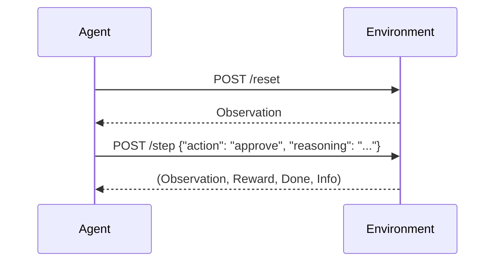

# 📄 Invoice Verification RL Environment

A deterministic, OpenEnv-compatible reinforcement learning environment for evaluating agent decision-making and reasoning on invoice verification tasks.

---

## 🚀 Overview

This project models invoice verification as an interactive RL-style environment instead of a simple classification problem. 

Agents are required to:
- Analyze structured invoice data
- Make a decision (`approve` / `reject`)
- Provide a reasoning explanation
- Assign confidence

Each action is evaluated using a reward function that considers both correctness and reasoning quality.

---

## 🧠 Why This Is Interesting

- **Not just prediction** → State-action-reward loop
- **Evaluates reasoning quality**, not just accuracy
- **Designed for agent benchmarking**, not model training
- **Deterministic** → Results are reproducible and comparable

---

## ⚙️ Architecture

### Core Components

- **InvoiceEnvironment (`env/environment.py`)**  
  Handles episode lifecycle, invoice sampling, and state transitions.

- **Policy Engine (`env/policy.py`)**  
  Defines the ground truth logic for approval/rejection.  
  👉 *Single source of truth for correctness.*

- **Grader (`env/grader.py`)**  
  Computes reward based on:
  - Decision correctness
  - Reasoning quality (policy-aligned keywords)
  - Explanation strength

- **OpenEnv Adapter (`env/openenv_adapter.py`)**  
  Wraps the environment to comply with OpenEnv:
  - `reset()`
  - `step()`
  - `state` (property)

- **FastAPI Backend (`api/main.py`)**  
  Exposes environment via HTTP:
  - Session-safe
  - Per-user isolation
  - Production-style API design

- **Inference Pipeline (`inference.py`)**  
  Runs evaluation:
  - Rule-based agent
  - Optional LLM agent
  - Deterministic metrics tracking

- **Hugging Face App (`hf_space/app.py`)**  
  - API + Gradio UI
  - Supports manual invoice testing

---

## 🔁 Environment Flow



> [!NOTE]
> Each session is isolated using a unique `session_id`.

---

## 📦 Setup

```bash
# Install dependencies
pip install -r requirements.txt

# Run the API server
uvicorn api.main:app --reload
```

---

## 🧪 Run Evaluation

```bash
# Run deterministic evaluation
python inference.py --seed 42

# Optional: Run with LLM agent
python inference.py --use-llm
```

> [!TIP]
> If no API key is set when using `--use-llm`, it automatically falls back to the rule-based agent.

---

## 🔌 API Endpoints

| Method | Endpoint | Description |
|---|---|---|
| `GET` | `/` | Health check |
| `POST`| `/reset` | Start new episode |
| `POST`| `/step` | Take action |
| `GET` | `/state` | Get current state |
| `GET` | `/metadata` | Environment schema |

*All endpoints support `session_id` for isolation.*

---

## 🤖 OpenEnv Compatibility

The environment follows OpenEnv requirements:
- `reset()` → `observation`
- `step()` → `(observation, reward, done, info)`
- `state` → `property` (serializable)

*Environment schema is defined in `openenv.yaml`*

---

## 🌐 Hugging Face Deployment

The HF app:
- Exposes the same API as FastAPI
- Includes a Gradio UI for testing
- Maintains session isolation

**Run locally:**
```bash
uvicorn hf_space.app:app --reload
```

---

## 🎯 Reward Design

Reward is computed as:
- **Correct decision** → Base reward
- **Policy-aligned reasoning** → Keyword match score
- **Explanation quality** → Small bonus

**Key properties:**
- Bounded in `[0, 1]`
- Cannot be trivially gamed
- Requires meaningful reasoning for high scores

---

## 📊 Deterministic Evaluation

```bash
python inference.py --seed 42
```
- Same seed → Identical results
- Enables reproducible benchmarking
- Supports fair agent comparison

---

## 🏆 Key Strengths

- Deterministic and reproducible
- Policy-driven evaluation (no dataset leakage)
- Reasoning-aware reward system
- Session-safe API design
- OpenEnv + Hugging Face ready

---

## 🧩 Example Use Cases

- Benchmarking LLM reasoning
- Testing agent decision-making
- RL environment prototyping
- Evaluation framework for structured tasks

---

## 🏁 Summary

This project focuses on building a robust evaluation environment, not just a predictive model.

It provides a controlled, reproducible setup for testing how well agents:
- Understand structured data
- Make decisions
- Justify their reasoning